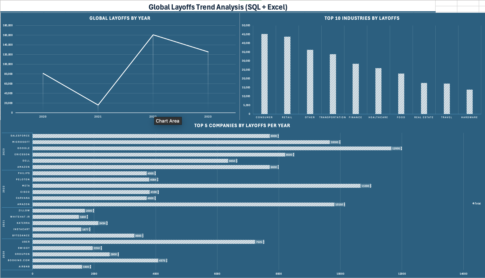

# Global Layoffs Trend Analysis (SQL + Excel)

## Overview
This project analyzes global layoff data using SQL for data exploration and aggregation, with Excel used as the reporting layer for visualization.

The goal was to demonstrate an end-to-end analytics workflow:
- Writing structured SQL queries to analyze trends and rankings
- Exporting clean outputs
- Building a concise dashboard to communicate insights

This project highlights both technical SQL skills and the ability to translate data into clear business insights.

---

## Tools Used
- MySQL
- SQL (Aggregations, CTEs, Window Functions, DENSE_RANK)
- Microsoft Excel
- PivotTables / PivotCharts
- CSV export workflow (SQL → Excel)

---

## Key Business Questions Answered (SQL)

- How did total layoffs change year over year?
- Which industries were most impacted?
- Which companies had the highest layoffs per year?
- What were the top 5 companies by layoffs within each year?
- How do layoffs vary by funding stage?

---

## SQL Highlights

This project includes:

- Aggregations using `SUM()` and `GROUP BY`
- Time-based analysis using `YEAR()` and monthly extraction
- Window functions using `DENSE_RANK()` for yearly company ranking
- Common Table Expressions (CTEs) for structured ranking logic
- Segmented analysis by industry and stage

All portfolio-ready queries are available in:

---

## SQL Analysis (Key Queries)

The analytical processing for this project was performed in MySQL before building the Excel dashboard. Below are representative queries used in the analysis.

### Yearly Layoff Trends

```sql
SELECT YEAR(`date`) AS year,
       SUM(total_laid_off) AS total_layoffs
FROM layoffs_cleaned
GROUP BY YEAR(`date`)
ORDER BY year;
```

This query aggregates layoffs by year to identify overall trend patterns.

---

### Top 5 Companies by Layoffs Per Year

```sql
WITH company_year AS (
    SELECT company,
           YEAR(`date`) AS years,
           SUM(total_laid_off) AS total_laid_off
    FROM layoffs_cleaned
    GROUP BY company, YEAR(`date`)
),
company_year_rank AS (
    SELECT *,
           DENSE_RANK() OVER (
               PARTITION BY years
               ORDER BY total_laid_off DESC
           ) AS ranking
    FROM company_year
)
SELECT *
FROM company_year_rank
WHERE ranking <= 5;
```

This query demonstrates:
- Common Table Expressions (CTEs)
- Window functions
- Partition-based ranking
- Year-over-year company segmentation

## Dashboard Preview



---

## Excel Reporting Layer

The Excel dashboard presents:

- Yearly layoff trend
- Top 10 industries by total layoffs
- Top 5 companies per year (Pivot-based ranking view)

The dashboard was built using exported SQL outputs and structured for clarity rather than excessive interactivity.

---

## Repository Structure

- `Layoffs_Portfolio_Analysis.sql` → Complete SQL analysis script  
- `Global_Layoffs_Dashboard.xlsx` → Final dashboard file  
- `yearly_layoffs_clean.csv` → Yearly aggregated export  
- `industry_layoffs_clean.csv` → Industry aggregation export  
- `top5_companies_by_year.csv` → Ranking export  

---

## Workflow Summary

1. Analyzed and aggregated data in MySQL
2. Built ranking logic using window functions
3. Exported structured datasets as CSV
4. Built a clean reporting dashboard in Excel
5. Structured the project for portfolio presentation

---

## Why This Project Matters

This project demonstrates the ability to:

- Move from raw data to structured insight
- Use SQL beyond basic SELECT statements
- Apply ranking and time-based analysis
- Present analytical findings in a clear reporting format

It reflects a practical analyst workflow rather than isolated tool usage.
